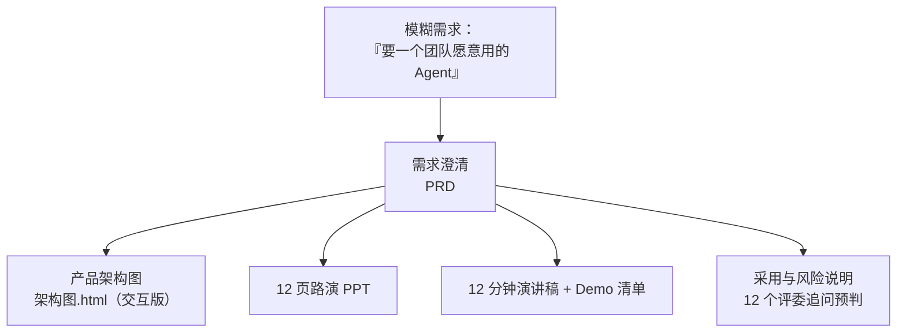

# 小澜 · FDE 三面全套路演交付物

> 48 小时，把一个模糊需求（「我要一个团队愿意用的 Agent」）变成完整产品方案 + 路演 · 评委评价「你们不是把 FDE 等同于外包」

---

## 📌 Problem（背景与问题）

笔记侠 FDE 加速营三面，**48 小时沙盘**。赛题：为「澄野商业」打造一个**强人群洞察老板 Agent**。

难点不在「做个 Agent」，而在**起点只有一个模糊需求**——没有 PRD、没有原型、没有验收标准。要在 48 小时内把它变成能上台讲清楚、能扛住评委追问的完整方案。

## 🤖 Why Agent（为什么这题的核心是「产品思维」）

「强人群洞察老板 Agent」不是一个技术题，是一个**「把模糊意图翻译成产品定义」的题**：

- 人群洞察是**什么**？—— 用户画像？行为聚类？需求预测？
- 「老板 Agent」要**替老板做什么**？—— 决策支持？自动执行？预警？
- 团队愿意用，靠**什么**？—— 不是功能多，是「用了确实省事」

这些问题的答案，决定了 Agent 的边界、架构、验收标准——**这才是 FDE（Field/Founder 交付工程）考察的东西**。

## 🏗️ Architecture（交付物结构）

| 产出 | 位置 | 说明 |
|------|------|------|
| 架构图 | `架构图.html` | 产品架构图（HTML 交互版，浏览器打开即看） |
| 路演 PPT | `PPT/index.html` | 12 页 PPT（HTML 版） |
| 演讲稿 + Demo 清单 | `docs/演讲稿+Demo操作清单.docx` | 12 分钟路演稿 + 演示步骤 |
| 采用与风险说明 | `docs/采用与风险说明.docx` | 12 个评委追问预判 + 风险应对 |

## 🛠️ Skills（核心能力体现）

这套交付物证明的是**「技术翻译能力」**——把模糊需求翻译成四样可交付、可检验的东西：

1. **结构化的需求澄清**（PRD）
2. **可交付的产品方案**（架构图）
3. **能上台讲清楚的路演材料**（PPT + 演讲稿）
4. **提前预判的评委追问**（12 个预判 + 应对）

## 🧰 团队分工

| 成员 | 角色 |
|------|------|
| 高佳慧 | 文档 / PPT / 路演（独立完成 PRD、12 页 PPT、演讲稿、架构图、采用与风险说明、12 个追问预判） |
| Edward / 梁曦霖 | 全部代码 |
| 邵俊钦 | 数据清洗 |

## 📊 Eval（结果 / 验证）

- 路演 12 分钟 + 追问 8 分钟
- **评委评价：「你们不是把 FDE 等同于外包」**——即真的理解了「交付」的本质，而不是拿 AI 应付差事

## 💥 Failure Cases（追问预判 / 风险应对）

「采用与风险说明」里预判了 12 个评委可能追问的问题并准备了应对，核心是三类风险：

1. **可行性风险**：Agent 能不能真的落地，还是 PPT 画饼
2. **采用风险**：团队为什么愿意用，而不是用了几天就弃
3. **边界风险**：Agent 该做什么、不该做什么

## 🎨 Design Decisions（设计决策）

| 决策 | 理由 |
|------|------|
| 全 HTML 交付（架构图/PPT 都是 HTML） | 浏览器打开即看，不依赖 PPT 软件，评审零障碍 |
| 预判 12 个追问而非被动应对 | 把「被问倒」的风险提前消化在方案里 |
| 强调「采用」而非「功能」 | 赛题关键词是「团队愿意用」，功能再多没人用等于零 |

---

*这是我「技术翻译能力」的证明——不做代码，但决定一个 AI 产品能不能被讲清楚、被采用、被落地。*
